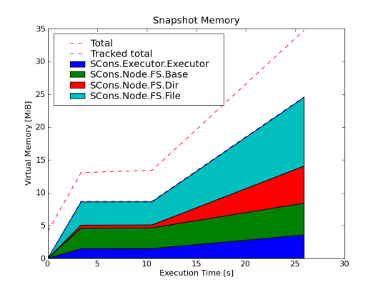

.. _classtracker_tutorial:

============================================
Tutorial - Tracking Class Instances in SCons
============================================

This tutorial demonstrates the class tracking facility to profile and optimize a
non-trivial program. SCons_ is a next-generation build system with a quite
elaborate architecture and thus an interesting candidate for profiling attempts.

Before we begin, it should be identified what shall be tracked, i.e. what
classes we want to connect to and whose instances are to be sized and profiled.
In this tutorial, the effect of a patch_ is analyzed that tries to size-optimize the very
heart of SCons - the ``Node`` class. Naturally, we will connect to the ``Node`` base
class and its sub-classes. It makes sense to put the profiling data
in context and track additional classes that are believed to contribute
significantly to the total memory consumption.

Installing hooks into SCons
---------------------------

The first step is to find the proper spots for connecting to the classes that
shall be tracked, taking snapshots, and printing the gathered profile data.
SCons has a simple memory profiling tool that we will override. The SCons
MemStats class provides all we need::
  
    from pympler.classtracker import ClassTracker

    class MemStats(Stats):
        def __init__(self):
            Stats.__init__(self)
            classes = [SCons.Node.Node, SCons.Node.FS.Base, SCons.Node.FS.File,
                       SCons.Node.FS.Dir, SCons.Executor.Executor]
            self.tracker = ClassTracker()
            for c in classes:
                self.tracker.track_class(c)
        def do_append(self, label):
            self.tracker.create_snapshot(label)
        def do_print(self):
            stats = self.tracker.stats
            stats.print_summary()
            stats.dump_stats('pympler.stats')

When SCons starts, ``MemStats`` is instantiated and the `ClassTracker` is
connected to a number of classes. SCons has predefined spots where it invokes
its statistics facilities with ``do_append`` being called. This is where
snapshots will be taken of all objects tracked so far.

Because of the large number of instances, only a summary is printed to the
console via ``stats.print_summary()`` and the profile data is dumped to a file
in case per-instance profile information is needed later.

Test run
--------

Time for a test. In the following examples, SCons builds a non-trivial program
with a fair number of nodes. Running SCons via ``scons --debug=memory`` will
print the gathered data to the console::
    
    scons: Reading SConscript files ...
    scons: done reading SConscript files.
    scons: Building targets ...
    scons: `.' is up to date.
    scons: done building targets.
    ---- SUMMARY ------------------------------------------------------------------
    before reading SConscript files:         active      4.17 MB      average   pct
      SCons.Executor.Executor                     7      7.53 KB      1.08 KB    0%
      SCons.Node.FS.Base                          1      9.30 KB      9.30 KB    0%
      SCons.Node.FS.Dir                           6     17.77 KB      2.96 KB    0%
      SCons.Node.FS.File                          1      2.91 KB      2.91 KB    0%
      SCons.Node.Node                             0      0     B      0     B    0%
    after reading SConscript files:          active     13.06 MB      average   pct
      [...]
    before building targets:                 active     13.41 MB      average   pct
      [...]
    after building targets:                  active     34.77 MB      average   pct
      SCons.Executor.Executor                  1311      3.57 MB      2.79 KB   10%
      SCons.Node.FS.Base                       1102      4.84 MB      4.50 KB   13%
      SCons.Node.FS.Dir                         108      5.67 MB     53.72 KB   16%
      SCons.Node.FS.File                       2302     10.45 MB      4.65 KB   30%
      SCons.Node.Node                             1     84.93 KB     84.93 KB    0%
    -------------------------------------------------------------------------------

Making sense of the data
------------------------

The console output may give a brief overview how much memory is allocated by
instances of the individual tracked classes. A more appealing and well arranged
representation of the data can be generated with the ``HtmlStats`` class. The
dump generated previously can be loaded and a set of HTML pages can be emitted::

    from pympler.classtracker_stats import HtmlStats

    stats = HtmlStats()
    stats.load_stats('pympler.stats')
    stats.create_html('pympler.html')

If ``matplotlib`` is installed, charts will be embedded in the HTML output:

At first sight it might seem suspicious that the tracked classes appear to be
the sole contributors to the total memory footprint of the application. Because
the tracked objects are sized recursively, referenced objects which are not
tracked themselves are added to the referrers account. Thus, a root object's
size will include the size of every leaf unless the leaf is also tracked by the
`ClassTracker`.

Optimization attempt
--------------------

After applying the patch_ by Jean Brouwers, SCons is rerun under the supervision
of the `ClassTracker`. The differences in the last snapshot show that the
changes indeed reduce the memory footprint of ``Node`` instances::

    $ scons --debug=memory
    scons: Reading SConscript files ...
    scons: done reading SConscript files.
    scons: Building targets ...
    scons: `.' is up to date.
    scons: done building targets.
    ---- SUMMARY ------------------------------------------------------------------
    [...]
    after building targets:                  active     32.41 MB      average   pct
      SCons.Executor.Executor                  1311      3.50 MB      2.73 KB   10%
      SCons.Node.FS.Base                       1102      4.29 MB      3.98 KB   13%
      SCons.Node.FS.Dir                         108      5.52 MB     52.30 KB   17%
      SCons.Node.FS.File                       2302      8.82 MB      3.92 KB   27%
      SCons.Node.Node                             1     84.32 KB     84.32 KB    0%
    -------------------------------------------------------------------------------

The total measured memory footprint dropped from 34.8MB to 32.4MB, ``File``
nodes' average size from 4.6KB to 3.9KB.

Summary
-------

This tutorial illustrated how applications can be profiled with the
`ClassTracker` facility. It has been shown how the memory impact of changes
can be quantified.

.. _SCons: http://www.scons.org
.. _patch: http://scons.tigris.org/issues/show_bug.cgi?id=2198
