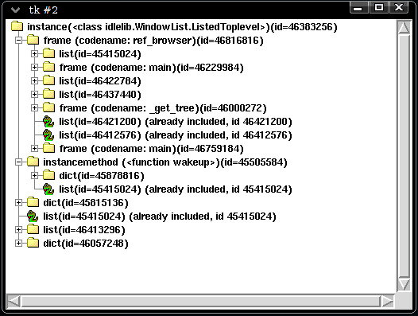

.. _intro:

=====
Intro
=====

Muppy is (yet another) Memory Usage Profiler for Python. The focus of this
toolset is laid on the identification of memory leaks. Let's have a look what
you can do with muppy.

The muppy module
================

Muppy allows you to get hold of all objects,

>>> import muppy
>>> all_objects = muppy.get_objects()
>>> len(all_objects)                           # doctest: +SKIP
9495

or filter out certain types of objects.

>>> import types
>>> types = muppy.filter(all_objects, Type=types.ClassType)
>>> len(types)                                    # doctest: +SKIP
17
>>> for t in types:
...     print t
...                                               # doctest: +SKIP
codecs.StreamWriter
codecs.StreamReader
codecs.StreamReaderWriter
codecs.StreamRecoder
encodings.utf_8.StreamWriter
encodings.utf_8.StreamReader
UserDict.IterableUserDict
UserDict.UserDict
UserDict.DictMixin
os._Environ
string._multimap
re.Scanner
sre_parse.Tokenizer
sre_parse.SubPattern
sre_parse.Pattern
distutils.log.Log
codecs.Codec

This result, for example, tells us that the number of lists remained the same,
but the memory allocated by lists has increased by 8 bytes. The correct increase
for a LP64 system (see 64-Bit_Programming_Models_). 

The summary module
==================

You can create summaries

>>> from muppy import summary
>>> sum1 = summary.summarize(all_objects)
>>> summary.print_(sum1)                          # doctest: +SKIP
                       types |   # objects |   total size
============================ | =========== | ============
			list |          87 |      1805512
                        dict |	       299 |       672776
                         str |        3922 |       287433
                       tuple |        2037 |	   167456
                        code |         532 |        63840
                    function |         496 |        59520
          wrapper_descriptor |         654 |        52320
                        type |          37 |        33448
  builtin_function_or_method |         377 |        27144
           method_descriptor |         253 |        18216
         <class 'abc.ABCMeta |          16 |        14464
                     weakref |         149 |        13112
                         set |          48 |        11136
           member_descriptor |         152 |        10944
           getset_descriptor |          77 |         5544

and compare them with other summaries.

>>> sum2 = summary.summarize(muppy.get_objects())
>>> diff = summary.get_diff(sum1, sum2)
>>> summary.print_(diff)                          # doctest: +SKIP
                                types |   # objects |   total size
===================================== | =========== | ============
                                 list |          59 |       723200
                                  str |          55 |         3059
                                  int |          42 |         1008
        frame (codename: get_objects) |           1 |          488
           frame (codename: <module>) |           1 |          424
                                tuple |           2 |          160
                                 code |           1 |          120

The tracker module
==================
Of course we don't have to do all these steps manually, instead we can use
muppy's tracker.

>>> from muppy import tracker
>>> tr = tracker.SummaryTracker()
>>> tr.print_diff()                               # doctest: +SKIP
                             types |   # objects |   total size
================================== | =========== | ============
                              list |          65 |       467440
                              dict |          19 |        20680
                wrapper_descriptor |         182 |        14560
                               str |          61 |         4722
                 member_descriptor |          33 |         2376
                             tuple |          34 |         2352
                           weakref |          14 |         1232
                 getset_descriptor |          17 |         1224
                               int |          39 |          936

A tracker object creates a summary (that is a summary which it will remember)
on initialization. Now whenever you call tracker.print_diff(), a new summary of
the current state is created, compared to the previous summary and printed to
the console. As you can see here, quite a few objects got in between these two
invocations. 
But if you don't do anything, nothing will change.

>>> tr.print_diff()                               # doctest: +SKIP
  types |   # objects |   total size
======= | =========== | ============

Now check out this code snippet

>>> i = 1
>>> l = [1,2,3,4]
>>> d = {}
>>> tr.print_diff()                               # doctest: +SKIP
  types |   # objects |   total size
======= | =========== | ============
   dict |           1 |          280
   list |           1 |          224

As you can see both, the new list and the new dict appear in the summary, but
not the 4 integers used. Why is that? Because they existed already before they
were used here, that is some other part in the Python interpreter code makes
already use of them. Thus, they are not new.

The refbrowser module
=====================

In case some objects are leaking and you don't know where they are still
referenced, you can use the referrers browser.
At first let's create a root object which we then reference from a tuple and a
list.

>>> from muppy import refbrowser
>>> root = "some root object"
>>> root_ref1 = [root]
>>> root_ref2 = (root, )

>>> def output_function(o):
...     return str(type(o))
...
>>> cb = refbrowser.ConsoleBrowser(root, maxdepth=2, str_func=output_function)

Then we create a ConsoleBrowser, which will give us a referrers tree starting at
`root`, printing to a maximum depth of 2, and uses `str_func` to represent
objects. Now it's time to see where we are at.

>>> cb.print_tree()                               # doctest: +SKIP
<type 'str'>-+-<type 'dict'>-+-<type 'list'>
             |               +-<type 'list'>
             |               +-<type 'list'>
             |
             +-<type 'dict'>-+-<type 'module'>
             |               +-<type 'list'>
             |               +-<type 'frame'>
             |               +-<type 'function'>
             |               +-<type 'list'>
             |               +-<type 'frame'>
             |               +-<type 'list'>
             |               +-<type 'function'>
             |               +-<type 'frame'>
             |
             +-<type 'list'>--<type 'dict'>
             +-<type 'tuple'>--<type 'dict'>
             +-<type 'dict'>--<class 'muppy.refbrowser.ConsoleBrowser'>

What we see is that the root object is referenced by the tuple and the list, as
well as by three dictionaries. These dictionaries belong to the environment,
e.g. the ConsoleBrowser we just started and the current execution context.

This console browsing is of course kind of inconvenient. Much better would be an
InteractiveBrowser. Let's see what we got.

>>> from muppy import refbrowser_gui
>>> ib = refbrowser_gui.InteractiveBrowser(root)
>>> ib.main()

Now you can click through all referrers of the root object.

.. _64-Bit_Programming_Models: http://www.unix.org/version2/whatsnew/lp64_wp.html
